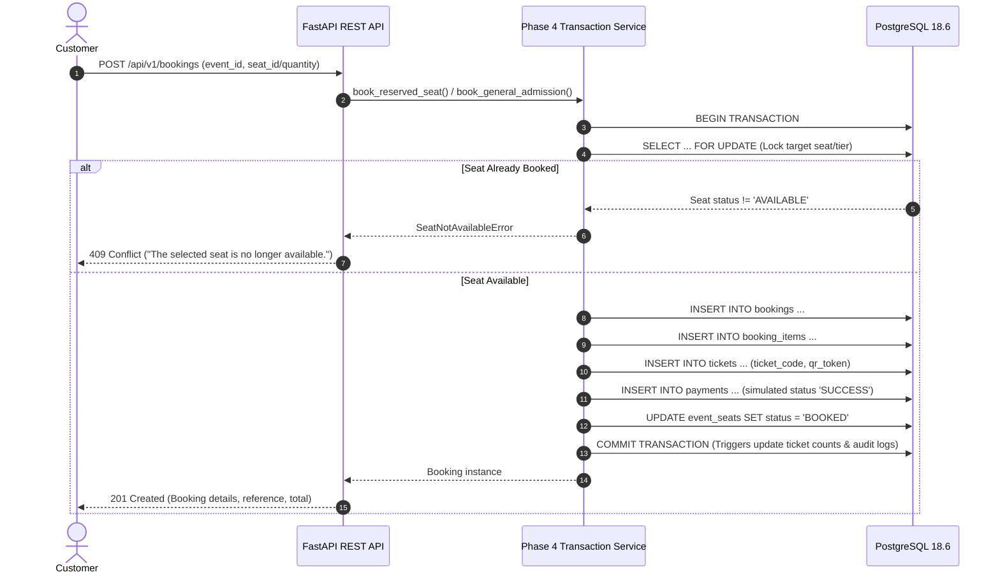

# EVENTHUB REST API Documentation

## Overview
EVENTHUB provides a secure, robust, fully documented REST API exposing DBMS functionality, event ticketing, simulated payments, gate ticket verification, and view-backed analytics.

- **Base URL**: `http://localhost:8000/api/v1`
- **Swagger UI (Interactive Docs)**: `http://localhost:8000/docs`
- **ReDoc Documentation**: `http://localhost:8000/redoc`
- **OpenAPI Schema**: `http://localhost:8000/api/v1/openapi.json`
- **Health Check**: `GET /health` or `GET /api/v1/health`

---

## 1. Authentication & Security Flow

All secured endpoints require an HTTP Bearer JWT token in the `Authorization` header:
```http
Authorization: Bearer <access_token>
```

### Flow:
1. **Registration**: `POST /api/v1/auth/register` assigns the `CUSTOMER` role by default. Passwords are never stored in plaintext and are hashed using PBKDF2-HMAC-SHA256 with cryptographically random salts.
2. **Login**: `POST /api/v1/auth/login` verifies credentials and returns:
   - `access_token` (expires in 60 minutes)
   - `refresh_token` (expires in 7 days)
   - `token_type`: `"bearer"`
3. **Token Refresh**: `POST /api/v1/auth/refresh` exchanges a valid refresh token for a fresh token pair.
4. **Current User Profile**: `GET /api/v1/auth/me` resolves the active user from the JWT payload (`sub` claim).
5. **Logout**: `POST /api/v1/auth/logout` implements stateless session termination.

---

## 2. Role-Based Access Control (RBAC)

Authorization is strictly derived server-side from the authenticated database user:

| Role | Permissions |
| :--- | :--- |
| **CUSTOMER** | Browse published events, view public seats and availability, book tickets, cancel own bookings, view own tickets, submit/manage reviews, manage favorites, view notifications. |
| **ORGANIZER** | Manage own organization profile, create draft events, manage ticket tiers, publish/cancel own events, inspect event sales and occupancy via PostgreSQL views. |
| **ADMIN** | System-wide governance, user role modification, user deactivation, venue and category curation, global view analytics, immutable audit logs inspection, hold release maintenance. |

---

## 3. Core API Endpoints

### Authentication (`/api/v1/auth`)
| Method | Endpoint | Access | Description |
| :--- | :--- | :--- | :--- |
| `POST` | `/auth/register` | Public | Register customer account |
| `POST` | `/auth/login` | Public | Authenticate credentials and receive JWTs |
| `POST` | `/auth/refresh` | Public | Refresh expired access token |
| `GET` | `/auth/me` | Authenticated | Retrieve caller identity profile |
| `POST` | `/auth/logout` | Authenticated | Terminate session |

### Users (`/api/v1/users`)
| Method | Endpoint | Access | Description |
| :--- | :--- | :--- | :--- |
| `GET` | `/users/me` | Authenticated | Get current user's profile |
| `PATCH` | `/users/me` | Authenticated | Update current user's name or phone |
| `GET` | `/users/{user_id}` | Authenticated | Public-safe user profile retrieval |

### Categories & Venues (`/api/v1/categories`, `/api/v1/venues`)
| Method | Endpoint | Access | Description |
| :--- | :--- | :--- | :--- |
| `GET` | `/categories` | Public | List all categories |
| `GET` | `/categories/{id}` | Public | Get category details |
| `GET` | `/venues` | Public | List all physical venues |
| `GET` | `/venues/{id}` | Public | Get venue details |
| `GET` | `/venues/{id}/seats` | Public | List venue physical seat blueprints |

### Events Catalog (`/api/v1/events`)
| Method | Endpoint | Access | Description |
| :--- | :--- | :--- | :--- |
| `GET` | `/events` | Public | Paginated published event catalog (filters: search, category, venue, dates) |
| `GET` | `/events/{id}` | Public | Full event details with ticket tiers and rating |
| `GET` | `/events/{id}/availability` | Public | Authoritative ticket and seat availability |
| `GET` | `/events/{id}/seats` | Public | Public seat map (strips private customer/booking hold IDs) |
| `GET` | `/events/{id}/ticket-types`| Public | Active ticket tiers for event |
| `GET` | `/events/{id}/reviews` | Public | Paginated verified event reviews |

### Bookings & Payments (`/api/v1/bookings`)
| Method | Endpoint | Access | Description |
| :--- | :--- | :--- | :--- |
| `POST` | `/bookings` | Customer | Create booking via Phase 4 row-locking transaction service |
| `GET` | `/bookings` | Customer | List customer's own bookings (paginated) |
| `GET` | `/bookings/{id}` | Customer | Inspect single booking details |
| `POST` | `/bookings/{id}/cancel` | Customer | Cancel booking and release reserved seats |
| `POST` | `/bookings/{id}/expire` | Customer | Expire pending booking and release held seats |
| `GET` | `/bookings/{id}/payment` | Customer | Get simulated payment transaction status |
| `POST` | `/bookings/{id}/payment/simulate` | Customer | Simulate payment gateway callback (`SUCCESS` / `FAILED`) |

### Tickets (`/api/v1/tickets`)
| Method | Endpoint | Access | Description |
| :--- | :--- | :--- | :--- |
| `GET` | `/tickets` | Customer | List issued digital tickets |
| `GET` | `/tickets/{id}` | Customer | View ticket details |
| `POST` | `/tickets/{id}/validate` | Authenticated | Gate scanner admission verification (`ACTIVE` -> `USED`) |

### Reviews, Favorites, Notifications
| Method | Endpoint | Access | Description |
| :--- | :--- | :--- | :--- |
| `POST` | `/events/{id}/reviews` | Customer | Submit review (rating 1-5, unique per user/event) |
| `PATCH`| `/reviews/{id}` | Customer | Update own review |
| `DELETE`| `/reviews/{id}` | Customer | Delete own review |
| `GET` | `/favorites` | Customer | List bookmarked events |
| `POST` | `/favorites/{event_id}` | Customer | Bookmark event (idempotent) |
| `DELETE`| `/favorites/{event_id}`| Customer | Remove bookmark |
| `GET` | `/notifications` | Customer | List in-app notifications |
| `PATCH`| `/notifications/{id}/read` | Customer | Mark single notification read |
| `PATCH`| `/notifications/read-all` | Customer | Mark all caller's notifications read |

### Organizer Management (`/api/v1/organizer`)
| Method | Endpoint | Access | Description |
| :--- | :--- | :--- | :--- |
| `GET` | `/organizer/profile` | Organizer | Get organization profile |
| `PATCH`| `/organizer/profile` | Organizer | Update organization details |
| `POST` | `/organizer/events` | Organizer | Create new event in `DRAFT` status |
| `GET` | `/organizer/events` | Organizer | List organizer's own events |
| `GET` | `/organizer/events/{id}` | Organizer | View organizer event details |
| `PATCH`| `/organizer/events/{id}` | Organizer | Update event properties |
| `POST` | `/organizer/events/{id}/publish` | Organizer | Transition from `DRAFT` to `PUBLISHED` |
| `POST` | `/organizer/events/{id}/cancel` | Organizer | Transition event to `CANCELLED` |
| `DELETE`| `/organizer/events/{id}` | Organizer | Delete `DRAFT` event |
| `POST` | `/organizer/events/{id}/ticket-types` | Organizer | Add ticket tier |
| `PATCH`| `/organizer/ticket-types/{id}` | Organizer | Modify ticket tier price or capacity |
| `DELETE`| `/organizer/ticket-types/{id}` | Organizer | Delete / deactivate ticket tier |
| `GET` | `/organizer/analytics/overview` | Organizer | Revenue overview from `v_organizer_revenue` |
| `GET` | `/organizer/analytics/events/{id}` | Organizer | Event sales metrics from `v_event_sales_summary` |

### Administration (`/api/v1/admin`)
| Method | Endpoint | Access | Description |
| :--- | :--- | :--- | :--- |
| `GET` | `/admin/users` | Admin | List all user accounts with filtering |
| `PATCH`| `/admin/users/{id}/status` | Admin | Activate or deactivate user account |
| `PATCH`| `/admin/users/{id}/role` | Admin | Change user role (`CUSTOMER`, `ORGANIZER`, `ADMIN`) |
| `POST` | `/admin/categories` | Admin | Create category |
| `PATCH`| `/admin/categories/{id}` | Admin | Update category |
| `DELETE`| `/admin/categories/{id}` | Admin | Delete category (safeguarded against FK violations) |
| `POST` | `/admin/venues` | Admin | Create venue |
| `PATCH`| `/admin/venues/{id}` | Admin | Update venue |
| `DELETE`| `/admin/venues/{id}` | Admin | Delete venue (safeguarded against FK violations) |
| `POST` | `/admin/venues/{id}/seats` | Admin | Create venue seat (enforces `UNIQUE(venue_id, seat_label)`) |
| `GET` | `/admin/analytics/overview` | Admin | Platform-wide operational KPI totals |
| `GET` | `/admin/analytics/events` | Admin | Query `v_event_sales_summary` |
| `GET` | `/admin/analytics/revenue` | Admin | Query `v_organizer_revenue` |
| `GET` | `/admin/analytics/bookings` | Admin | Query `v_monthly_booking_summary` |
| `GET` | `/admin/analytics/ratings` | Admin | Query `v_event_rating_summary` |
| `GET` | `/admin/audit-logs` | Admin | Query audit trail (strictly masks `password_hash`) |
| `POST` | `/admin/maintenance/release-expired-holds` | Admin | Execute `release_expired_holds()` PostgreSQL function |

---

## 4. End-to-End Booking Workflow



---

## 5. Standard Error Responses

Errors return consistent JSON payloads with descriptive detail:

### 409 Conflict (Seat Double-Booking Prevention)
```json
{
  "detail": "The selected seat is no longer available."
}
```

### 401 Unauthorized (Expired or Missing Token)
```json
{
  "detail": "Token has expired. Please login again."
}
```

### 403 Forbidden (Insufficient Privileges)
```json
{
  "detail": "Administrative privileges required"
}
```

### 404 Not Found
```json
{
  "detail": "Event '999999' not found"
}
```

### 422 Validation Error
```json
{
  "detail": [
    {
      "type": "greater_than",
      "loc": ["body", "quantity"],
      "msg": "Input should be greater than 0"
    }
  ]
}
```

---

## 6. Example Requests & Responses

### Registration
**Request:**
```http
POST /api/v1/auth/register
Content-Type: application/json

{
  "full_name": "Rohan Gupta",
  "email": "rohan.gupta@example.com",
  "password": "SecurePassword@2026",
  "phone": "+919876543210"
}
```

**Response (`201 Created`):**
```json
{
  "id": 45,
  "full_name": "Rohan Gupta",
  "email": "rohan.gupta@example.com",
  "phone": "+919876543210",
  "role": "CUSTOMER",
  "is_active": true,
  "created_at": "2026-10-01T22:00:00Z"
}
```

### Login
**Request:**
```http
POST /api/v1/auth/login
Content-Type: application/json

{
  "email": "rohan.gupta@example.com",
  "password": "SecurePassword@2026"
}
```

**Response (`200 OK`):**
```json
{
  "access_token": "eyJhbGciOiJIUzI1NiIsInR5cCI6IkpXVCJ9...",
  "refresh_token": "eyJhbGciOiJIUzI1NiIsInR5cCI6IkpXVCJ9...",
  "token_type": "bearer",
  "expires_in_seconds": 3600
}
```

### Create Reserved Booking
**Request:**
```http
POST /api/v1/bookings
Authorization: Bearer <access_token>
Content-Type: application/json

{
  "event_id": 8,
  "ticket_type_id": 19,
  "event_seat_id": 330,
  "payment_method": "UPI",
  "discount_amount": "0.00"
}
```

**Response (`201 Created`):**
```json
{
  "id": 142,
  "user_id": 45,
  "event_id": 8,
  "event_title": "Symphony Under the Stars",
  "booking_reference": "EVH-TX-3F8B1A9C",
  "status": "CONFIRMED",
  "subtotal": "1299.00",
  "discount_amount": "0.00",
  "tax_amount": "233.82",
  "total_amount": "1532.82",
  "created_at": "2026-10-01T22:15:00Z",
  "expires_at": null
}
```

### Validate Ticket Admission
**Request:**
```http
POST /api/v1/tickets/150/validate
Authorization: Bearer <access_token>
```

**Response (`200 OK`):**
```json
{
  "id": 150,
  "ticket_code": "EVH-TKT-8A7B2C1D",
  "previous_status": "ACTIVE",
  "current_status": "USED",
  "message": "Ticket validated successfully. Admission granted.",
  "validated_at": "2026-10-01T22:20:00Z"
}
```
