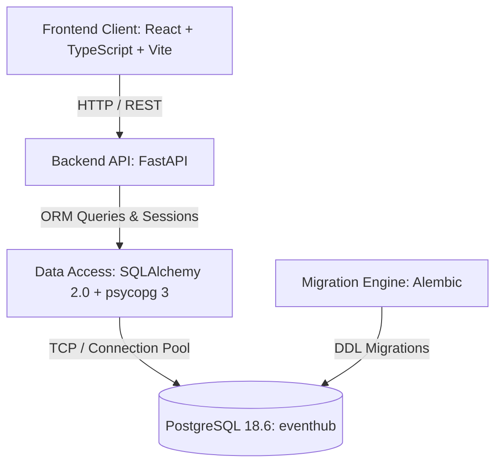

# Architecture Overview

This document outlines the architectural foundation for **EVENTHUB**, a full-stack Event & Ticket Booking Management System.

## Layered System Architecture

EVENTHUB adopts a clean, layered architecture separating user interface, API orchestration, object-relational mapping, and database persistence:

```text
React (TypeScript + Vite + Tailwind CSS)
  ↓
FastAPI (Python REST Framework)
  ↓
SQLAlchemy (ORM & Connection Pool via psycopg 3)
  ↓
PostgreSQL 18.6 (eventhub Relational Database)
```



### 1. Presentation Layer (Frontend)
- Built with React 19, TypeScript, and Vite.
- Styled using Tailwind CSS for clean, responsive design.
- Consumes JSON endpoints from the FastAPI backend.

### 2. Application & API Layer (Backend)
- Powered by FastAPI on Python 3.13.
- Modular route and setting configuration (`app.core.config.Settings`).
- Provides system health monitoring (`GET /health`) and OpenAPI/Swagger documentation.

### 3. Data Access & Persistence Layer
- **SQLAlchemy 2.0**: Declarative ORM models defining all 16 core relational entities with explicit typing, relationships, and constraints.
- **psycopg 3**: Native binary PostgreSQL driver providing high performance and connection management.
- **Alembic**: Database migration framework ensuring reproducible and reversible schema versioning.
- **PostgreSQL 18.6**: Relational core ensuring ACID guarantees, foreign key constraints, check constraints, unique candidate keys, and optimized B-tree indexes.

## Status: Phase 2 (Database Foundation)
- [x] Phase 1: Project skeleton, virtual environment, and FastAPI health endpoint.
- [x] Phase 2: Complete 16-table relational schema modeled in SQLAlchemy and migrated to PostgreSQL via Alembic.
- [ ] Phase 3: Fictional seed data, views, triggers, and stored procedures.
